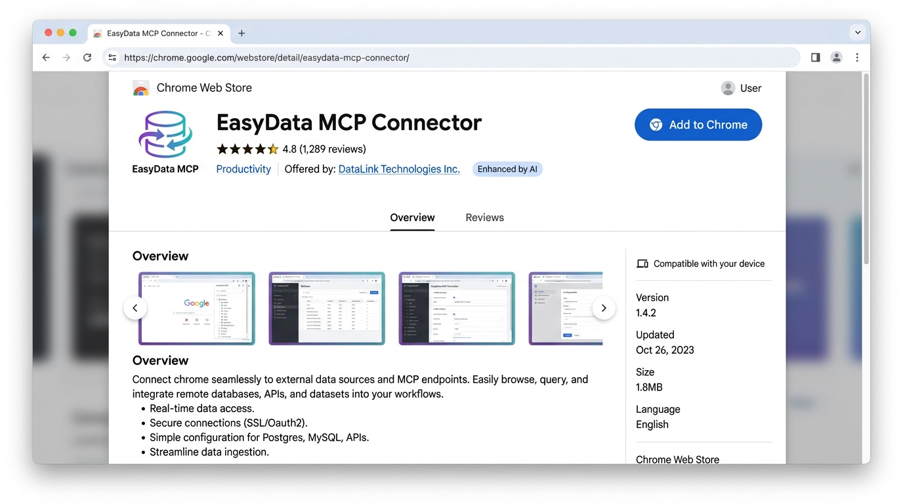
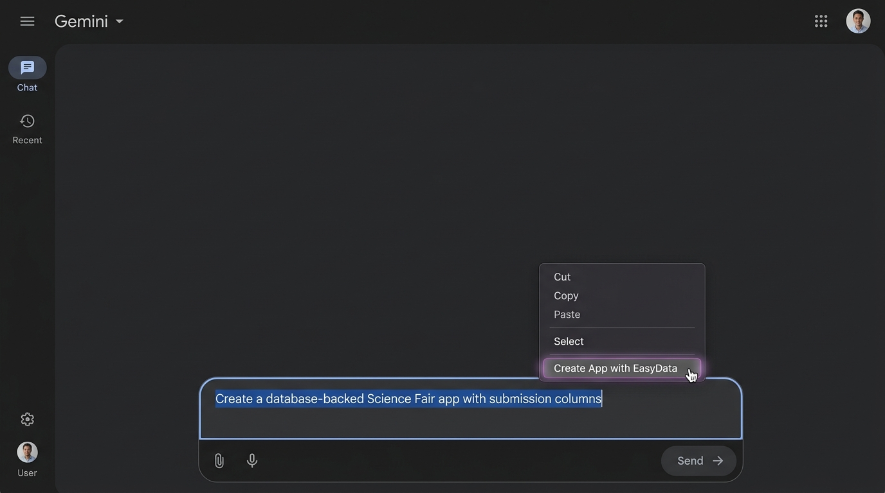

# 🚀 Guide: Gemini MCP Extension & Chrome Web Store Setup

This guide details how to install the **EasyData MCP Connector** extension directly from the Chrome Web Store, configure your application prompts with specific external links and structures, and use the context menu to build database-backed web applications in Google Gemini.

---

## 📥 1. Install the Extension from the Chrome Web Store

To install the extension directly from the store:

1. Open **Google Chrome** on your computer.
2. Navigate to the [Chrome Web Store](https://chromewebstore.google.com).
3. In the search box, search for **easydata MCP connector**.
4. Select the extension from the search results.
5. Click **Add to Chrome** and confirm the installation. The extension icon will now appear in your browser toolbar.

> [!TIP]
> Make sure the extension is enabled in your extensions menu (accessed via the puzzle piece icon 🧩 in the Chrome toolbar).

---

## ✍️ 2. Write a Specific App Prompt (with Links)

Gemini generates the database tables and UI structure based entirely on your prompt. To get the best results, you must be **very specific** about your database columns, views, and include links if you want external integrations.

### Anatomy of a Specific Prompt:
1. **Database Schema**: Explicitly define the tables and field names (e.g. `student_name`, `photo_url`, `submission_date`).
2. **Visual Layout**: Describe the interface style (e.g., modern card layout, responsive grids, dark mode).
3. **Specific Links**: Include any relevant external reference links or resource endpoints in the prompt so Gemini knows where to redirect or display them.

### 📋 Example Prompt:
> "Create a database-backed **Student Science Project Showcase** app. 
> 
> **Database Structure:**
> - Table: `submissions`
> - Columns: `id` (Primary Key), `student_name` (Text), `project_title` (Text), `description` (Text), `resource_link` (Text), `submission_timestamp` (Timestamp).
> 
> **UI Requirements:**
> - Build a responsive frontend using Tailwind CSS. 
> - Include a student entry form and a project list dashboard.
> - Display a helpful link in the header: **[Official Science Fair Rules](https://example.com/rules)** so students can check details."

---

## 🖱️ 3. Highlight and Right-Click to Build the App

Once you have written your prompt, use the context menu to trigger the build:

1. Open [gemini.google.com](https://gemini.google.com).
2. Type your detailed prompt in the main chat input field.
3. ⚠️ **Do not press Enter yet.**
4. Select/highlight the entire text of the prompt you just wrote.
5. Right-click the highlighted text to open the Chrome context menu.
6. Select **Create App with EasyData** (or **Create App with EasyData MCP Connector**).

7. A loading indicator will appear indicating that the EasyData server is provisioning your database and UI.
8. Wait **15–20 seconds** for the compilation to complete.
9. The extension will automatically generate your live application link and paste it into your chat box. Press **Enter** to submit and share your app!
